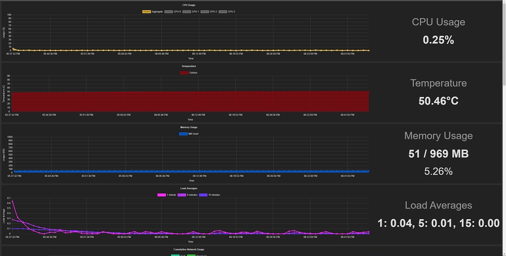

+++
title = "Making My Website Part 1: Monitoring On A Raspberry Pi"
description = "Why and how I made a simple system monitor for my Raspberry Pi in Rust."
tags = ["web-dev", "raspberry-pi", "rust"]
external_discussions = [{ name = "/r/rust", url = "https://www.reddit.com/r/rust/comments/o4d9xw/writing_a_simple_raspberry_pi_system_monitor_in/" }, { name = "/r/programming", url = "https://www.reddit.com/r/programming/comments/o4de29/writing_a_simple_raspberry_pi_system_monitor_in/"}]
+++

When I first set out to make a personal website, I knew I wanted to host it on a Raspberry Pi. Why? Well, my brother had given me a Raspberry Pi 3 B+ a few...years ago, and I never did anything with it because (1) I'm lazy and (2) I never came up with a good use for it. But I recently (well, recently-ish) started making a video game, and I wanted to have a dev blog for it at some point. So one day when I was feeling particularly distracted from my video game, I decided to make a website to host said blog on. I figured hosting it on the Raspberry Pi would be a fun adventure. And I recently learned [Rust](https://www.rust-lang.org/), so in an act born out of a desire to do more Rust things, I also decided to write my own web server/static site generator thing in Rust.

Sure, using a pre-existing static site generator and serving my site via a CDN would probably be faster and simpler and just better overall. But it wouldn't be as fun or provide as much of a learning experience, presumably. And most importantly it wouldn't allow me to use my Raspberry Pi for something. There's something cool about looking over and seeing my cute little Raspberry Pi, knowing it's running software I wrote myself to serve my website out to the internet.

## Ok let's get going on this web server
Hold on a minute now. As all good enterprise software engineers know, you have to have good monitoring set up for your stuff or you're in for a really annoying time if anything ever breaks. I like to think of myself as a good software engineer, so naturally I had to set up some sort of monitoring thing.

In the spirit of this project, of course I wouldn't use some existing monitoring solution. No, I would write my own in Rust. Those wheels aren't gonna re-invent themselves.

## So what does this monitoring thing need
Initially, I thought it would just be a simple API running on the Pi that would return the current system state, then I would call it via some client software running on my desktop to visualize the stats. But I realized pretty quickly that the easier route would be to just have a simple dashboard (in the form of a webpage) hosted on the Pi itself, that way it would be completely self-contained.

So to answer the question I posed to myself in the header up there, I would need a simple webpage served from the Raspberry Pi that displays system stats in graph form. And the graphs would necessitate storing a history of the stats.

## Sounds like you need some way to gather system stats
It does sound that way, narrative device in the form of headers. Since I'm writing this in Rust, it'll be in the form of a crate. There are a few options here, but I'm going to focus on just a couple.

### Heim
[Heim](https://heim-rs.github.io/) seems to be the "robust" system stats crate. By that I mean it's complicated, but powerful, and built with a philosophy of "doing it the right way, not the easy way". As this seems to jive with the philosophy behind Rust, you would think this would be an easy pick. I mean, it's got a whole website and everything! This crate is surely going places. But I tried it out and it just seemed a little overly complex for me, while at the same time missing some features found in other system stats crates. (At this point I don't remember specifically what features I wanted but weren't there, sorry!) I'm sure at some point Heim will surpass the feature set of the other options (maybe it already has), but at the time I decided it wasn't for me.

### systemstat
I found [systemstat](https://github.com/unrelentingtech/systemstat) to be a good mix of a simple enough API and all the features I wanted. That's pretty much all I have to say about it I guess. Kind of underwhelming after writing so much about Heim. Oh well.

*Note: The rest of this post contains a bunch of Rust code snippets, but don't worry, you don't necessarily need to understand the code in them to follow the post. They're just for extra context.*

I added the `systemstat` dependency,
```toml
systemstat = "0.1.7"
```

made a struct to store the stats in,
```rust
use chrono::{DateTime, Local};

pub struct AllStats {
    /// General system stats
    pub general: GeneralStats,
    /// CPU stats
    pub cpu: CpuStats,
    /// Memory stats
    pub memory: Option<MemoryStats>,
    /// Stats for each mounted filesystem
    pub filesystems: Option<Vec<MountStats>>,
    /// Network stats
    pub network: NetworkStats,
    /// The time at which the stats were collected
    pub collection_time: DateTime<Local>,
}
```

and used systemstat to fill it to the brim with delicious stats. I'm not going to reproduce all the code for gathering the stats here ([check it out on GitHub if you're interested](https://github.com/rotoclone/system-stats-dashboard/blob/0.2.0/src/stats.rs)), but here's a taste of how I gather RAM stats:

```rust
pub struct MemoryStats {
    /// Megabytes of memory used
    pub used_mb: u64,
    /// Megabytes of memory total
    pub total_mb: u64,
}

impl MemoryStats {
    /// Gets memory stats for the provided system. Returns `None` if an error occurs.
    pub fn from(sys: &System) -> Option<MemoryStats> {
        match sys.memory() {
            Ok(mem) => {
                let used_mem = saturating_sub_bytes(mem.total, mem.free);
                Some(MemoryStats {
                    used_mb: bytes_to_mb(used_mem),
                    total_mb: bytes_to_mb(mem.total),
                })
            }
            Err(e) => {
                log("Error getting memory usage: ", e);
                None
            }
        }
    }
}
```

## Cool, so we're done with monitoring
Ha ha, no. There's still the matter of converting the stats from a big pile in memory to a graph you can look at with your human eyes. Also the stats need to update themselves periodically. Let's go over that next.

So the code to update the stats and keep a rolling history of recent stats is actually pretty complicated. Basically, I start up a thread that periodically gathers new stats and adds them to a list. Once the list reaches a certain size, it gets cleared out and all the stats that were in it get "consolidated" (aka averaged) into a single `AllStats` struct, which is placed into a [circular buffer](https://en.wikipedia.org/wiki/Circular_buffer). That way I can keep the stats up to date by gathering data often, and the consolidation allows me to store a longer history of stats in memory than if I had to keep around every single data point.

Here's the important part of the stats updating code:
```rust
/// Stats history that updates itself periodically.
pub struct UpdatingStatsHistory {
    /// The thread that handles updating the stats.
    _update_thread: JoinHandle<()>,
    /// The stats history.
    pub stats_history: Arc<Mutex<StatsHistory>>,
}

impl UpdatingStatsHistory {
    /// Creates an `UpdatingStatsHistory`.
    ///
    /// # Arguments
    /// * `system` - The system to gather stats from.
    /// * `cpu_sample_duration` - The amount of time to take to sample CPU load. Must be less than `update_frequency`.
    /// * `update_frequency` - How often new stats should be gathered. Must be greater than `cpu_sample_duration`.
    /// * `history_size` - The maximum number of entries to keep in the history.
    /// * `consolidation_limit` - The number of times to gather stats before consolidating them and adding them to the history.
    /// * `persistence_config` - Configuration for persisting history to disk.
    pub fn new(
        system: System,
        cpu_sample_duration: Duration,
        update_frequency: Duration,
        history_size: NonZeroUsize,
        consolidation_limit: NonZeroUsize,
        persistence_config: HistoryPersistenceConfig,
    ) -> UpdatingStatsHistory {
        let mut recent_stats = Vec::with_capacity(consolidation_limit.get());
        // gotta keep 2 references to the stats history: one for the update thread and one for other code to look at
        // cuz what good are self-updating system stats if no one can see them
        let shared_stats_history = Arc::new(Mutex::new(StatsHistory::new(history_size)));
        let update_thread_stats_history = Arc::clone(&shared_stats_history);
        let update_thread = thread::spawn(move || loop {
            // gather new stats and add them to the list of recent stats
            let new_stats = AllStats::from(&system, cpu_sample_duration);
            recent_stats.push(new_stats.clone());

            if recent_stats.len() >= consolidation_limit.get() {
                // the recent stats list has grown too large for its own good, we must consolidate
                let consolidated_stats = consolidate_all_stats(recent_stats);

                {
                    // this part is in its own block so the mutex lock is held for the minimum time,
                    // since no one can look at the stats history while this is happening
                    let mut history = update_thread_stats_history.lock().unwrap();
                    history.update_most_recent_stats(consolidated_stats);
                    history.push(new_stats);
                }
                recent_stats = Vec::with_capacity(consolidation_limit.get());
            } else {
                // this keeps the most recent entry in the stats history up to date with the most
                // recently gathered stats, since `recent_stats` isn't visible outside of this thread
                let mut history = update_thread_stats_history.lock().unwrap();
                history.update_most_recent_stats(new_stats);
            }

            // yeah yeah I know this won't be exactly the right amount of time but it's close enough
            thread::sleep(update_frequency - cpu_sample_duration);
        });

        UpdatingStatsHistory {
            _update_thread: update_thread,
            stats_history: shared_stats_history,
        }
    }
}
```

I don't want to lose all the stats history if the Pi shuts down though, so I made it write them to disk. I didn't want to deal with the complexity of a database, so I turned to the tried-and-true "files with JSON in them" strategy. Using [serde](https://serde.rs/) (the gold standard for serialization and deserialization in Rust), every time consolidated stats are written to the circular buffer, they also get serialized to JSON and written to a file. Once that file reaches a certain size, it gets renamed so new stats are written to a fresh file. And once the new file reaches that certain size, it gets renamed to overwrite the old file and the cycle repeats.

Here's the code to write the stats to disk:
```rust
fn persist_stats(stats: &AllStats, dir: &Path, dir_size_limit_bytes: u64) -> io::Result<()> {
    // first, ensure the directory we're going to write to exists
    if !dir.exists() {
        create_dir_all(dir)?;
    }

    let current_stats_path = dir.join(CURRENT_HISTORY_FILE_NAME);
    let old_stats_path = dir.join(OLD_HISTORY_FILE_NAME);

    // divide size limit by 2 since this swaps between 2 files
    if current_stats_path.exists()
        && current_stats_path.metadata()?.len() >= (dir_size_limit_bytes / 2)
    {
        // stats too big, bye bye old stats
        rename(&current_stats_path, &old_stats_path)?;
    }

    let mut current_stats_file = OpenOptions::new()
        .create(true)
        .append(true)
        .open(current_stats_path)?;
    // slap some JSON in there
    writeln!(current_stats_file, "{}", serde_json::to_string(stats)?)?;

    Ok(())
}
```

And I added this to the stats updating code (I made it configurable and everything, wow):
```rust
if recent_stats.len() >= consolidation_limit.get() {
    // the recent stats list has grown too large for its own good, we must consolidate
    let consolidated_stats = consolidate_all_stats(recent_stats);
    if let HistoryPersistenceConfig::Enabled { dir, size_limit } = &persistence_config {
        if let Err(e) = persist_stats(&consolidated_stats, dir, *size_limit) {
            println!("Error persisting stats to {:?}: {}", dir, e);
        }
    }
// ... the rest of the code from above ...
```

Astute readers will note that half of the persisted stats history will suddenly disappear whenever the new file gets large enough and gets renamed to overwrite the old file. That is true. But I can live with it, since it makes the code to manage the stats persistence simpler.

You can [see the complete stats history code on GitHub](https://github.com/rotoclone/system-stats-dashboard/blob/0.2.0/src/stats_history.rs).

## But how do my human eyes see the pretty graphs
Yes yes, getting to that. For this we'll need something that can serve web pages. Something like...[Rocket](https://rocket.rs/)! As far as Rust web frameworks go, I've only tried Rocket and [Actix Web](https://actix.rs/), and I prefer Rocket. So that's what I went with. It's pretty easy to use. (Spoiler alert: my custom web server thing will also use Rocket.) Since I'm living on the cutting edge here, I decided to use the fancy new release candidate of Rocket 0.5. Mainly just because Rocket 0.5 uses stable Rust instead of nightly, but the fact that it's async was also a factor.

Look how easy:

```toml
rocket = { version = "0.5.0-rc.1", features = ["json"] }
rocket_dyn_templates = { version = "0.1.0-rc.1", features = ["tera"] }
```

```rust
/// Endpoint to view the dashboard.
// `dark` is an optional query parameter to control whether to use dark mode or not
// cuz I like to keep my options open
#[get("/dashboard?<dark>")]
fn dashboard(stats_history: &State<UpdatingStatsHistory>, dark: Option<bool>) -> Template {
    let context = DashboardContext::from_history(
        &stats_history.stats_history.lock().unwrap(),
        dark.unwrap_or(DEFAULT_DARK_MODE),
    );
    Template::render("dashboard", &context)
}

#[launch]
fn rocket() -> Rocket<rocket::Build> {
    let mut rocket = rocket::build()
        .mount("/", routes![dashboard])
        .attach(Template::fairing());

    // ... code to get a bunch of config values ...

    rocket = rocket
        .manage(persistence_config.clone())
        .manage(UpdatingStatsHistory::new(
            System::new(),
            CPU_LOAD_SAMPLE_DURATION,
            Duration::from_secs(update_frequency_secs),
            NonZeroUsize::new(recent_history_size).unwrap(),
            NonZeroUsize::new(consolidation_limit).unwrap(),
            persistence_config,
        ));

    rocket
}
```
([Full code here](https://github.com/rotoclone/system-stats-dashboard/blob/0.2.0/src/main.rs))

I decided to go with [Chart.js](https://www.chartjs.org/) to draw the graphs, and later noticed that [crates.io](https://www.crates.io/) uses it too (for the graphs of crate downloads over time). Neat. Anyway [here's the dashboard template if you wanna take a peek](https://github.com/rotoclone/system-stats-dashboard/blob/0.2.0/templates/dashboard.html.tera).

And now the moment we've all been waiting for...feast your human eyes on the pretty graphs:

[](pretty_graphs_large.jpg)

## So NOW we're done with monitoring
Now we are. At least, done with making the thing that does the monitoring. I guess technically it's not really "monitoring" because there isn't anything that alerts me if stats go outside of configured ranges or anything. But it does what I need it to do, which is allow me to quickly see resource usage on my Raspberry Pi. Maybe I'll add email alerts someday.

Anyway, there's still some stuff to set up on the Pi to make the dashboard server thing start automatically when the Pi boots up and stuff. But I'll save that for another post.