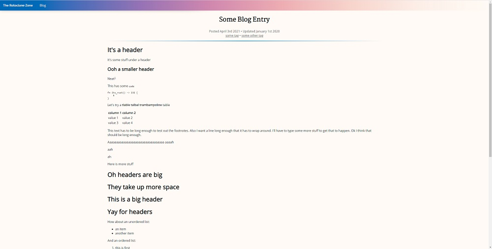
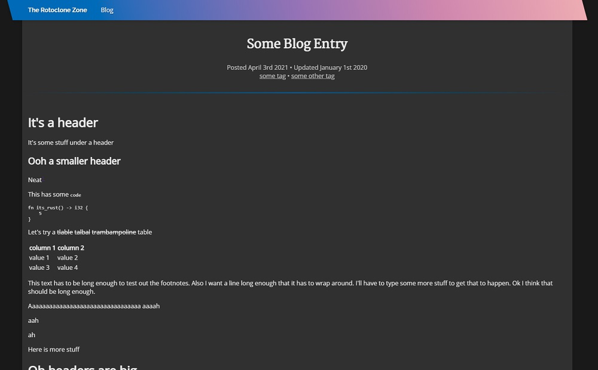
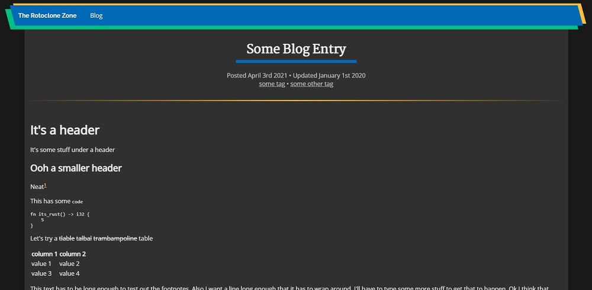
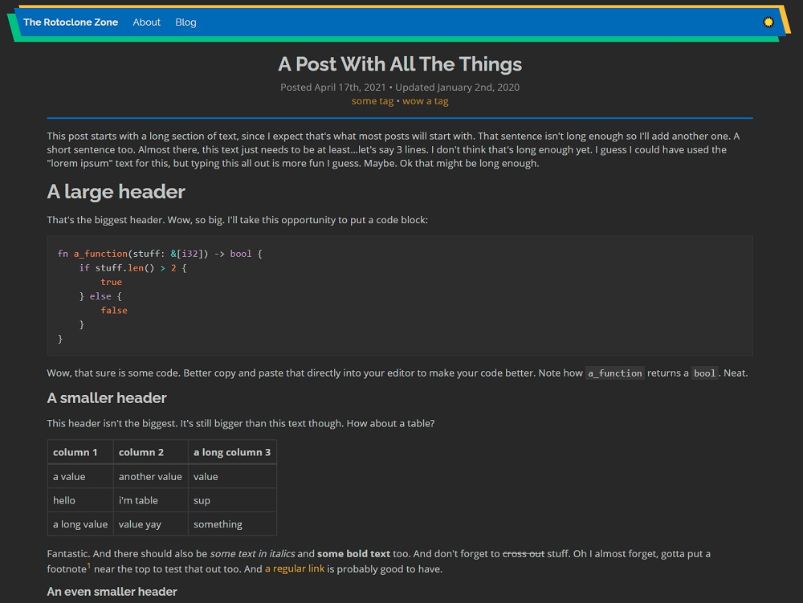

+++
title = "Making My Website Part 2: The Webserver"
description = "How I built a hybrid webserver/static site generator in Rust."
tags = ["web-dev", "rust"]
external_discussions = [{ name = "/r/rust", url = "https://www.reddit.com/r/rust/comments/qovsbv/an_overview_of_the_webserver_i_wrote_for_my_blog/" }]
+++

[(Part 1 is here.)](/blog/posts/raspberry-pi-monitoring)

If you're gonna have a website, in my experience it's a good idea to have something that gives people the site's pages when they ask for them. So, as mentioned in [part 1](/blog/posts/raspberry-pi-monitoring), I decided to write my own hybrid webserver/static site generator for this website in [Rust](https://www.rust-lang.org/) to fulfill that role.

## What's a static site generator?
If you're not familiar, a static site generator is a thing that takes a bunch of files describing a website and renders them into a pile of HTML and stuff, so then you can just serve those static HTML files instead of having to spend time re-rending every page whenever someone asks for it. So for example, you might have pages for listing all the blog posts written in a given year. The static site generator would find all the posts for each year there are posts and generate pages for every year with the right links, without you having to maintain those pages manually. And when you add a new post, you just re-generate the site and everything gets updated automatically.

This strategy wouldn't work for a site like Twitter with a lot of dynamic content (since you would have to re-render the entire website whenever someone tweets anything), but for a blog that only changes when you add a new post, it works really well. There are a bunch of perfectly fine static site generators that already exist (like [Hugo](https://gohugo.io/) and [Zola](https://www.getzola.org/)), and which probably would have been better logical choices. (I think I would have gone with Zola mainly because it's written in Rust.) But I chose to write my own...for the adventure.

## What's this about a "hybrid"
A "pure" static site generator (based on my understanding; I've never actually used one so I could be wrong) pre-renders all the HTML for the entire website, so you can then serve it however you like just as 100% static pages. I chose to have mine pre-render some pages as HTML, but render other pages on-demand. Why? Because it seemed easier that way. It makes it slightly faster to re-render the website (since it's not rendering, for example, all the pages for all the blog post tags), and it makes the code slightly simpler (since it doesn't have to, for example, loop through all the tags for all the blog posts).

Since I figured the individual blog post pages would be the ones getting the most traffic, and so would benefit the most, those are the only pages that get pre-rendered.

## Alright I get it, how does it work
Just like for the monitoring thing, I chose [Rocket](https://rocket.rs/) as my web framework for this project. When the server starts, it clears out the configured rendered HTML directory, then pre-renders all the blog posts, saves them there, and keeps track of all of them in a struct, which is "managed" by Rocket:
```rust
// grab the configured site content and rendered HTML directories
let config = rocket.figment();
let site_base_dir = config
    .extract_inner::<String>(SITE_CONTENT_BASE_DIR_CONFIG_KEY)
    .unwrap_or_else(|_| DEFAULT_SITE_CONTENT_BASE_DIR.to_string());
let html_base_dir = config
    .extract_inner::<String>(RENDERED_HTML_BASE_DIR_CONFIG_KEY)
    .unwrap_or_else(|_| DEFAULT_RENDERED_HTML_BASE_DIR.to_string());

println!("Building site...");
// clear out any existing rendered HTML
match std::fs::remove_dir_all(&html_base_dir) {
    Ok(()) => (),
    Err(e) => match e.kind() {
        std::io::ErrorKind::NotFound => (),
        _ => panic!("error deleting {}: {}", html_base_dir, e),
    },
};
// actually build the site
let updating_site =
    UpdatingSite::from_dir(PathBuf::from(site_base_dir), PathBuf::from(html_base_dir))
        .unwrap_or_else(|e| panic!("error building site: {:?}", e));
println!("Site built successfully.");
// here you go little `updating_site`, Rocket is your new mommy
rocket = rocket.manage(updating_site);
```

Then when the page for a blog post is accessed, Rocket passes in the site it was given earlier, and serves the rendered HTML:
```rust
#[get("/blog/posts/<entry_name>")]
fn get_blog_entry(entry_name: String, updating_site: &State<UpdatingSite>) -> Option<Template> {
    // ask nicely for read access to the site struct
    //
    // the `unwrap()` here will only panic if the lock is poisoned, i.e. if someone else panicked
    // while holding write access to the lock, and if somebody's panicking we might as well all panic
    let site = &updating_site.site.read().unwrap();
    // find the blog post that was requested
    let entry = site
        .blog_entries
        .iter()
        .find(|entry| entry.metadata.slug == entry_name);

    // return the rendered page, or `None` if there was no blog post found
    // (in which case Rocket will respond with a 404)
    entry.map(|x| {
        Template::render(
            x.metadata.template_name.clone(),
            site.build_blog_entry_context(&x)
                .unwrap_or_else(|e| panic!("error rendering blog entry {}: {}", entry_name, e)),
        )
    })
}
```
([Full code here](https://github.com/rotoclone/rotoclone-zone/blob/899ac5f25fdb6447429b975ca0406d568abe4809/src/main.rs))

Now you may be thinking "Hey it's not pre-rendered, it literally calls a function called `render` when a blog post is accessed!". And that is true, there is some rendering going on when a blog post is accessed. Technically, the only part of my site that's pre-rendered is the actual content of the blog posts themselves. I write them in markdown, and the pre-rendering process is just converting that markdown into HTML (using [`pulldown-cmark`](https://crates.io/crates/pulldown-cmark)). When a blog post page is accessed, the rendering that happens is taking that HTML and putting it in the "blog post" template I created, which adds the navigation menu and title and footer and all that stuff.

You might think it would be more efficient to pre-render the complete HTML for the blog post pages to files so there would be no rendering at all going on for each request, and it probably would be, but the rendering is pretty fast actually: I did some benchmarks of serving static text vs the same text rendered via a template, and the response time averaged out almost exactly the same. Now, the benchmark was for a very small page, but still. I'm not super worried about the rendering taking too long. I haven't benchmarked it so I don't know for sure, but it's possible it wouldn't even be that bad to ditch the pre-rending altogether and just parse the markdown into HTML on every pageload. The pre-rendering code is already written though, so I wouldn't have much to gain by throwing it away at this point.

Now if you're not familiar with templates--

## Wait wait whaddaya mean "templates"??
Yes, so templates are basically just HTML with special sections for stuff pulled out of the context you pass to it. I chose to use [Tera](https://tera.netlify.app/) templates, because Rocket only has built-in support for Tera and [Handlebars](https://handlebarsjs.com/), and based on [some benchmarks I found](https://github.com/djc/template-benchmarks-rs), Tera is faster.

Here's what my blog post template looks like (pretty much):
```html


    <base href="/blog/posts/{{ slug }}/">
    <div class="text-container">
        <div class="blog-heading">
            <h1 class="blog-title">{{ base.title }}</h1>
            <!-- ...other metadata stuff omitted... -->
        </div>
    </div>
    <hr />
    <div class="text-container blog-content">
        <!-- Here's the actual post content -->
        <p>{{ entry_content | safe }}</p>
    </div>
    

```
([All the templates for my site are here](https://github.com/rotoclone/rotoclone-zone/tree/master/templates))

When a blog post is requested, a template context struct is built for the requested post (via the call to `site.build_blog_entry_context`) and passed to the template, which generates the HTML you're looking at right now. Or well, generates the HTML which tells your web browser how to display the page you're looking at...you know what I mean.

Anyway...

## Seems like all the interesting bits are in this `UpdatingSite` struct
Right you are! Let's take a look at it. But first, I want to explain what the markdown file for a blog post looks like. It has 2 sections: the "front matter" and the actual content. The front matter (a term I stole from Zola, which may have stolen it from elsewhere) is all the metadata about the post, like its title and tags and stuff, in [TOML](https://toml.io/) format. Here's the front matter for this post:
```toml
+++
title = "Making My Website Part 2: The Webserver"
description = "How I built a hybrid webserver/static site generator in Rust."
tags = ["web-dev", "rust"]
external_discussions = [{ name = "/r/rust", url = "https://www.reddit.com/r/rust/comments/qovsbv/an_overview_of_the_webserver_i_wrote_for_my_blog/" }]
+++
```
It's enclosed in `+++` to separate it from the actual content, which goes below it. I chose 3 plus signs because that's what Zola uses, and why figure out a good delimiter to use that won't conflict with markdown or TOML syntax when someone's already done it for you?

Under the front matter is the actual content (I won't reproduce the entire content here because writing a quine in markdown seems hard):
```markdown
[(Part 1 is here.)](/blog/posts/raspberry-pi-monitoring)

If you're gonna have a website, in my experience it's a good idea to have something that gives people the site's pages when they ask for them.
```
If you're interested, the full source for this blog post can be found [here](https://github.com/rotoclone/rotoclone-zone-content/blob/master/blog/webserver/content.md).

The markdown file gets put in the site content directory, as `blog/<whatever>/content.md`. Each post gets its own directory so I can also include images and stuff related to the post along with it. The `<whatever>` is the post's "slug", aka the name of the post for URL purposes. The slug for this post is "webserver", so it can be accessed at `/blog/posts/webserver`.

Ok, so the `UpdatingSite` struct. The `UpdatingSite` struct wraps the `Site` struct, whose job is to walk the site content directory, parse and keep track of the front matter for each blog post, turn the content into HTML, and save it in the rendered HTML directory:
```rust
#[derive(Debug)]
pub struct Site {
    pub blog_entries: Vec<BlogEntry>,
}

#[derive(Debug, PartialEq)]
pub struct BlogEntry {
    pub title: String,
    pub description: String,
    pub metadata: PageMetadata,
    pub tags: Vec<String>,
    pub created_at: DateTime<Utc>,
    pub updated_at: Option<DateTime<Utc>>,
    pub comments_enabled: bool,
    pub external_discussions: Vec<ExternalDiscussion>,
}

#[derive(Debug, PartialEq)]
pub struct PageMetadata {
    source_file: PathBuf,
    pub associated_files: Vec<AssociatedFile>,
    pub html_content_file: PathBuf,
    pub slug: String,
    pub template_name: String,
}

#[derive(Debug, PartialEq)]
pub struct AssociatedFile {
    pub relative_path: PathBuf,
    pub full_path: PathBuf,
}

#[derive(Debug, PartialEq, Deserialize)]
pub struct ExternalDiscussion {
    pub name: String,
    pub url: String,
}

impl Site {
    /// Builds the site model from the provided source directory, and puts rendered HTML in the provided HTML directory.
    ///
    /// # Errors
    /// Returns any errors that occur while reading from the file system or parsing file contents.
    pub fn from_dir(source_dir: &Path, html_dir: &Path) -> anyhow::Result<Site> {
        let blog_entries_source_dir = source_dir.join(BLOG_ENTRIES_DIR_NAME);
        let blog_entries_html_dir = html_dir.join(BLOG_ENTRIES_DIR_NAME);

        let mut blog_entries: Vec<BlogEntry> = Vec::new();
        // loop through everything in the site content directory
        for file in blog_entries_source_dir.read_dir().with_context(|| {
            format!(
                "error reading from {}",
                blog_entries_source_dir.to_string_lossy()
            )
        })? {
            let file = file.with_context(|| {
                format!(
                    "error reading from {}",
                    blog_entries_source_dir.to_string_lossy()
                )
            })?;

            // only directories correspond to posts, so regular files are ignored
            if is_dir(&file)? {
                // turn the markdown into HTML + metadata
                let entry = parse_entry_dir(&file, &blog_entries_html_dir)?;
                // can't have multiple posts with the same slug because that means they would have the same URL
                if blog_entries
                    .iter()
                    .any(|existing_entry| entry.metadata.slug == existing_entry.metadata.slug)
                {
                    bail!(
                        "Blog entry in {} has non-unique slug: {}",
                        file.path().to_string_lossy(),
                        entry.metadata.slug
                    );
                }
                // this post has a unique slug, so put it with the others
                blog_entries.push(entry);
            }
        }

        // sort the posts from newest to oldest, since that's how they'll be displayed in lists
        blog_entries.sort_by(|a, b| a.created_at.cmp(&b.created_at).reverse());
        Ok(Site { blog_entries })
    }
}
```
The real fun stuff happens in `parse_entry_dir`, but I'm not going to reproduce it all here because it's a lot. [The full code is here](https://github.com/rotoclone/rotoclone-zone/blob/899ac5f25fdb6447429b975ca0406d568abe4809/src/site.rs) if you want to take a look.

I didn't want to have to restart the server every time I updated the site, so I created an `UpdatingSite` struct, which uses [hotwatch](https://crates.io/crates/hotwatch) to listen for changes to the site content directory and update the site struct in-place whenever it needs to:
```rust
/// Site that updates itself when changes to its source directory are detected.
pub struct UpdatingSite {
    /// The `Hotwatch` instance that handles updating the site.
    _hotwatch: Hotwatch,
    /// The site.
    pub site: Arc<RwLock<Site>>,
}

impl UpdatingSite {
    /// Builds an updating site from the provided source directory, and puts rendered HTML in the provided HTML directory.
    ///
    /// # Errors
    /// Returns any errors that occur while reading from the file system or parsing file contents.
    pub fn from_dir(
        source_dir: PathBuf,
        html_dir: PathBuf,
    ) -> Result<UpdatingSite, Box<dyn Error>> {
        // first build the site
        let site = Site::from_dir(&source_dir, &html_dir)?;

        // one reference for Rocket (or whoever)
        let shared_site = Arc::new(RwLock::new(site));
        // one reference for hotwatch
        let hotwatch_site = Arc::clone(&shared_site);

        let mut hotwatch = Hotwatch::new()?;
        // set up hotwatch to keep track of the site content directory
        hotwatch.watch(source_dir.clone(), move |event: Event| {
            // this code will be run whenever changes to the content directory are detected
            match event {
                // The `NoticeRemove` and `NoticeWrite` events are separate from the regular `Remove` and `Write` events;
                // they fire immediately as soon as changes to the watched directory are detected, even if the file in
                // question is still being written to. So ignore those since the site should only be rebuilt once
                // everything settles down. `Error` events are ignored too, since the site doesn't need to be rebuilt
                // just because the filesystem is upset about something.
                Event::NoticeRemove(_) | Event::NoticeWrite(_) | Event::Error(_, _) => return,
                _ => (),
            };

            println!("Changes detected, rebuilding site... ({:?})", event);
            // build a new site from the updated content directory
            match Site::from_dir(&source_dir, &html_dir) {
                Ok(site) => {
                    println!("Site rebuilt successfully.");
                    // swap out the old site for the new site
                    *hotwatch_site.write().unwrap() = site;
                }
                Err(e) => println!("Error rebuilding site: {:?}", e),
            };
        })?;

        Ok(UpdatingSite {
            _hotwatch: hotwatch,
            site: shared_site,
        })
    }
}
```
That's pretty much the whole file, but [here it is in GitHub](https://github.com/rotoclone/rotoclone-zone/blob/899ac5f25fdb6447429b975ca0406d568abe4809/src/updating_site.rs) if you want.

The `Site` is stored in a `RwLock` so it's safe to update it while the server is running. Any number of things can get read access to a `RwLock` at the same time, but getting write access blocks until all the currently held read locks are released and then blocks anything else from getting read access until the write lock is released. It's basically just a `Mutex`, except allowing read access to multiple things at once. That way requests to the server that require access to the site struct won't get blocked waiting for other requests to release the lock.

Utilizing the `RwLock`, the new site is built in the background, and then requests to access pages will only be blocked during the brief time it takes to swap out the reference to the old site for the reference to the new site.

With all that set up, adding or modifying any of my blog posts is as simple as logging into my Raspberry Pi and doing a `git pull` on my site content repo. Nice.

## So that's it?
Not quite. I also wanted to serve some static files, like CSS and stuff. So I made a directory for that stuff, and told Rocket to serve files from it:
```rust
// In Rocket, routes with lower ranks have higher priority. The `rank(10)` is so if I accidentally
// include a file with the same path as some other route, it'll use the dynamic route instead of
// serving the static file.
rocket = rocket.mount("/", FileServer::from("static").rank(10))
```
I originally specified the path as `relative!("static")`, but apparently that specifies an absolute path on the machine the binary is *built* on, meaning it didn't work if I built the binary on my desktop and copied it to somewhere else. (Which I want to do because building in release mode takes 45 minutes on my Raspberry Pi, compared to 2 minutes on my desktop.) I changed it to just `"static"` and that seems to point to the directory called "static" relative to wherever the binary is running, which is what I want. Moral of the story: if you want to reference files relative to where your binary will be running...don't use Rocket's `relative!` macro.

Anyway, then I spent way too long messing with the CSS and fonts until I ended up with what you see now. I of course took the time to make styles for a dark mode *and* a light mode, which you can toggle using the sun/moon icon waaay up at the top of the page on the right side of the navigation bar, in case you missed it.

Here are some of my design iterations:

[](old_style_1_large.jpg)

[](old_style_2_large.jpg)

[](old_style_3_large.jpg)

And, for posterity, the style at the time of writing:

[](current_style_large.jpg)

And there we have it, my own custom webserver in Rust, serving up pages that are (at least in my opinion) pretty stylin'. Next stop: comments and analytics. But I'll save those for another post. Or two posts.